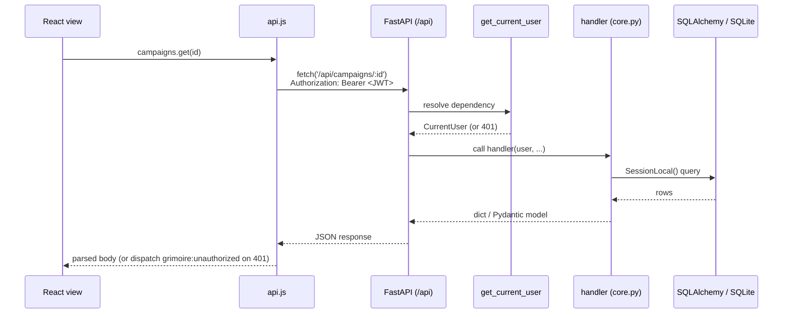
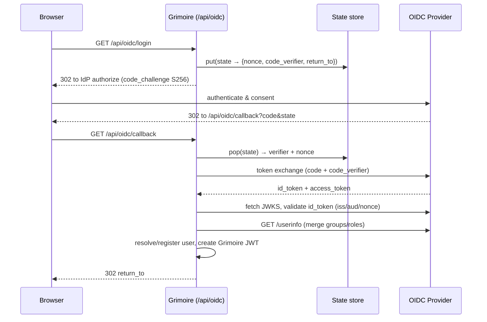

# Architecture

A developer-facing map of how Grimoire fits together: what lives where, how a request
flows end-to-end, how authentication and OIDC work, and how schema changes are applied at
startup. It complements the high-level overview in the [README](../README.md) and the
schema reference in [`docs/data-model.md`](data-model.md).

All `file_path` references point at the current code - if you change a module's shape,
update the matching section here.

## Stack

- **Frontend** - React 18 + Vite 6 SPA, React Router v6, React Context (no Redux/Zustand),
  i18next (see [`frontend/src/locales/`](../frontend/src/locales) for available locales),
  Vitest + React Testing Library.
- **Backend** - FastAPI (async) + SQLAlchemy 2.0, SQLite with FTS5 full-text search,
  PyMuPDF (`fitz`) for PDF→WebP rendering, PyJWT auth.
- **Optional** - Valkey/Redis for in-memory page-image caching (falls back to disk).

The FastAPI backend serves both the REST API under `/api/*` and the static React build
(`frontend/dist/`) via a catch-all route. In development, Vite proxies `/api` to the
backend on port 9481.

## Module map

### Backend

| Path | Responsibility |
| --- | --- |
| [`backend/main.py`](../backend/main.py) | FastAPI app construction, router registration, the `lifespan` startup hook (library scan, user seeding, wiki migrations, scheduler), and the SPA catch-all `serve_frontend`. |
| [`backend/config.py`](../backend/config.py) | Environment loading, `DATA_PATH`/`LIBRARY_PATH` and cache dirs, logging setup (incl. the in-memory ring buffer for `/api/logs`), the SQLAlchemy `engine` + `SessionLocal`, the `get_db` dependency, and the optional `_valkey` client. |
| [`backend/models/`](../backend/models/) | ORM models split by domain (`library.py`, `media.py`, `users.py`, `campaigns.py`, `settings.py`); `db.py` holds `init_db`, runtime migrations, and FTS5 setup. See [`docs/data-model.md`](data-model.md). |
| [`backend/auth.py`](../backend/auth.py) | JWT creation/validation, password hashing (`bcrypt_sha256`), the `get_current_user` dependency, and the role-guard dependencies (`require_admin`, `require_gm_or_admin`, `require_not_guest`). |
| [`backend/indexer/`](../backend/indexer/) | Library scanning, PDF FTS5 indexing, thumbnail generation, and OPF/metadata parsing. PDF text extraction runs in an isolated subprocess (see below). |
| [`backend/pdf_worker.py`](../backend/pdf_worker.py) | Standalone entry point for the spawned PDF text-extraction process. Imports only `fitz`/OCR libs - never `backend.config` - so a throwaway extraction child does not open the DB or run migrations. |
| [`backend/addons/`](../backend/addons/) | Community add-ons: installable metadata scrapers. Manifest validation, on-disk discovery and install state, integrity-verified installation, HTTP fetching with a response cache, the declarative interpreter (records → ranked search → mapped fields), the isolated script runner, and the fetched-vs-current diff. See [`docs/addons.md`](addons.md). |
| [`backend/addon_worker.py`](../backend/addon_worker.py) | Standalone entry point for the spawned add-on script process. Like `pdf_worker`, imports nothing from `backend` - a child running third-party code must not reach the DB or our internals. |
| [`backend/routers/`](../backend/routers/) | One package per feature area (see the router shape below). |
| [`backend/scheduler.py`](../backend/scheduler.py), [`backend/session_creator.py`](../backend/session_creator.py) | Campaign session scheduling - apply recurrence on startup and auto-create upcoming sessions. |
| [`backend/sessions.py`](../backend/sessions.py) | Login-session lifecycle behind refresh tokens: issue, rotate, revoke. Access tokens stay stateless; this is what makes a session revocable. |
| [`backend/session_purger.py`](../backend/session_purger.py) | Daily background thread deleting long-dead `auth_sessions` rows. Claims a file lock so only one worker runs it. |
| [`backend/seed_users.py`](../backend/seed_users.py) | First-run / env-driven user pre-seeding. |

#### Router package shape

Every package under `backend/routers/` follows the same layout (larger packages add focused
modules like [`books/pages.py`](../backend/routers/books/pages.py) or
`campaigns/sessions.py`):

- `__init__.py` - builds the `APIRouter` and registers routes via `add_api_route(...)`.
  Auth-adjacent packages expose **two** routers: a `public_router` (mounted directly on the
  app, no auth) and a `router` (mounted under the authenticated `/api` parent). See
  [`routers/auth/__init__.py`](../backend/routers/auth/__init__.py).
- `core.py` - the endpoint handler functions (plain functions, no decorators).
- `_schemas.py` - Pydantic request/response models (when needed).
- `_helpers.py` - shared internal helpers (when needed).

### Frontend

| Path | Responsibility |
| --- | --- |
| [`frontend/src/App.jsx`](../frontend/src/App.jsx) | Router setup, protected routes, and the context-provider tree. |
| [`frontend/src/api.js`](../frontend/src/api.js) | Centralized `fetch` wrapper - attaches the JWT, handles errors, exposes the `mediaUrl(...)` helper for `?token=` image/download URLs, and the per-feature API namespaces (`campaigns`, `auth`, `settings`, …). |
| [`frontend/src/context/`](../frontend/src/context/) | `AuthContext` (token + current user), `UISettingsContext`, `FavoritesContext`. |
| [`frontend/src/views/`](../frontend/src/views/) | Page-level components - one per route. |
| [`frontend/src/components/`](../frontend/src/components/) | Shared UI components (one component per file - enforced by ESLint). |
| [`frontend/src/hooks/`](../frontend/src/hooks/), [`frontend/src/utils.js`](../frontend/src/utils.js) | Reusable hooks and helpers. |

## Request lifecycle

A typical authenticated API call:



Key points:

- **Frontend** - [`api.js`](../frontend/src/api.js) reads the JWT from `localStorage`
  (`grimoire_token`) and sends it as an `Authorization: Bearer` header. On any `401` it
  dispatches a `grimoire:unauthorized` window event; `AuthContext` listens and clears the
  stored token, bouncing the user to login.
- **Auth boundary** - the authenticated API is a single parent router built with
  `APIRouter(prefix="/api", dependencies=[Depends(get_current_user)])` in
  [`main.py`](../backend/main.py#L203). Every sub-router mounted under it inherits the JWT
  requirement. Truly public endpoints (`/api/auth/status|setup|login`, OIDC, health, some
  library routes) are registered as separate `public_router`s mounted directly on the app.
- **Handler → DB** - handlers open a session via `SessionLocal()` (or the `get_db`
  dependency) and return dicts/Pydantic models that FastAPI serializes to JSON.
- **Static assets** - the Vite build's hashed assets are mounted at `/assets` via
  `StaticFiles`. Any other non-`/api` path falls through to `serve_frontend`, which returns
  the requested file if it exists (with a path-traversal guard) or `index.html` with
  `Cache-Control: no-store` so the SPA can client-route.

### Page images and caching

Book pages are rendered on demand by
[`routers/books/pages.py`](../backend/routers/books/pages.py) (`serve_book_page`):

1. If a rendered WebP is already in **Valkey** (when configured), stream it back.
2. Else if it's on the **disk cache**
   (`DATA_PATH/page_cache/<path-hash>_<content-token>_<page>_<width>.webp`), serve it (and
   backfill Valkey).
3. Else **render** the page with PyMuPDF, write it to both caches, and stream it.

Both cache keys embed a **content token** - the first 8 hex chars of the book's
`content_hash` (`content_token()` in
[`services/content_cache.py`](../backend/services/content_cache.py)). This is what makes the
caches genuinely content-addressed: replacing a file at the same path yields a different
token, so the previous renders become unreachable rather than being served as if they were
current. Rows that predate content hashing fall back to a digest of the path, preserving the
old behaviour until the next scan backfills them.

All three paths send `Cache-Control: max-age=31536000, immutable`
(`_PAGE_CACHE_HEADERS` in [`config.py`](../backend/config.py)) plus an `ETag` carrying the
same token, so browsers cache aggressively but can still revalidate a replaced file (the
`immutable` policy alone would pin a stale page for a year). Because image/download URLs are
used in ``/download contexts that can't set an `Authorization` header, they authenticate
via the HttpOnly session cookie. Thumbnails work the same way, cached under
`DATA_PATH/thumbnails/`.

The disk cache is bounded by `PAGE_CACHE_MAX_MB` and trimmed oldest-first by
`sweep_page_cache()` at startup and after each library scan - superseded renders are
unreachable but still occupy space, so a sweep is what reclaims them.

### Change and move detection

`scan_library` records each file's `content_hash` alongside `file_mtime` + `file_size`. The
stat pair is a cheap gate: a rescan re-hashes a file only when its mtime or size changed, so
an unchanged library is walked without reading any file contents (see
[`indexer/hashing.py`](../backend/indexer/hashing.py)). This matters because a full-library
hash on every scheduled rescan would be I/O-bound on the entire collection.

Two things fall out of storing the hash:

- **Replaced in place** (same path, new bytes) - `_handle_replaced_book` calls
  `invalidate_book_content` to drop the page caches, open PyMuPDF handle, FTS rows, and
  thumbnail, then clears the completeness flags so the normal thumbnail/page-count/indexing
  phases rebuild the book.
- **Moved** (new path, same bytes) - `_detect_moves` runs inside `_reconcile_missing`, which
  already knows exactly which rows just went missing. A match re-points the existing row
  instead of leaving it missing and inserting a duplicate, so tags, favorites, bookmarks, and
  reading progress survive (issue #284). It is accepted only when exactly one gone row and
  exactly one *newly inserted* row share a hash. Restricting destinations to new rows is what
  keeps byte-identical duplicates (common in TTRPG libraries) safe: a file that was already
  there did not move, so it can never be claimed as somewhere else's destination.

## Authentication & OIDC

### JWT and roles

- Tokens are HS256 JWTs signed with `SECRET_KEY`, carrying `sub` (user id), `username`,
  `role`, and a 30-day `exp` - see `create_token` / `decode_token` in
  [`auth.py`](../backend/auth.py).
- **Roles**: `admin` (full access incl. user management), `gm` (edit metadata, rescan,
  manage content), `player` (read-only), plus `guest` - a campaign-scoped, code-only
  account with no library access.
- `get_current_user` accepts the token from either the `Authorization: Bearer` header **or**
  a `?token=` query param, so browser-embedded images and downloads authenticate without a
  header. Role guards (`require_admin`, `require_gm_or_admin`, `require_not_guest`) layer on
  top per-route.

### Password / guest login

`POST /api/auth/login` verifies a username/password (bcrypt) and returns a JWT.
`POST /api/auth/guest-login` exchanges a 10-char campaign invite code for a guest-scoped
JWT (only when guest access is enabled). First-run `POST /api/auth/setup` creates the
initial admin. All three are public routes - see
[`routers/auth/__init__.py`](../backend/routers/auth/__init__.py).

### OIDC (authorization code + PKCE)

Implemented in [`routers/oidc/`](../backend/routers/oidc/) against any standards-compliant
IdP (Keycloak, Authentik, Authelia, Auth0, Okta, …). The IdP is configured at runtime via
**Settings → Authentication**; each field can be pinned/locked by an environment variable
(`OIDC_*`, see the `OIDC_ENV` map in [`config.py`](../backend/config.py#L53)).



Notes:

- **PKCE + nonce** - `oidc_login` generates a `state`, `nonce`, and PKCE verifier/challenge,
  stashes the per-flow secrets in the state store keyed by `state`, and redirects to the
  IdP's authorization endpoint (endpoints are read from config or auto-discovered from the
  issuer's `.well-known/openid-configuration`).
- **State store** - `_StateStore` in
  [`routers/oidc/_helpers.py`](../backend/routers/oidc/_helpers.py) is an in-process dict
  with a 10-minute TTL. This is sufficient for a single replica; a multi-replica deployment
  would need a shared store (tracked for the Valkey-backed state/JWKS work).
- **Callback** - `oidc_callback` validates `state`, exchanges the code for tokens, validates
  the `id_token` against the IdP's JWKS (checking issuer/audience/nonce), optionally merges
  `/userinfo` claims (some IdPs only expose groups there), resolves or auto-registers the
  user, then mints a Grimoire JWT.
- **Token handoff** - the JWT is returned in the redirect **URL fragment**
  (`#oidc_token=...`) rather than a query param, so it isn't logged by intermediate proxies.
  The frontend reads it from the fragment and stores it like any other token.

## Startup and migrations

The `lifespan` async context manager in [`main.py`](../backend/main.py#L87) runs once per
process on startup:

1. **Single-worker guard** - acquire a non-blocking `flock` on `DATA_PATH/.scan.lock`. Only
   the winning worker runs the startup library scan; others skip it. The scan runs on a
   background daemon thread so it doesn't block the app coming up.
2. **User seeding** - `seed_users(...)` applies env-driven / first-run accounts.
3. **Wiki migrations** - `wiki_migration` and `wiki_category_migration` roll legacy session
   notes and flat note-categories into the current nested-page model.
4. **Scheduler** - apply campaign session recurrence and start the session creator (skipped
   under pytest).

### Crash-isolated PDF indexing

PDF text extraction can crash the interpreter natively - a malformed object that
segfaults MuPDF, or an out-of-memory kill on a low-RAM host - which no
`try/except` can catch. Left unguarded this is catastrophic: the killed worker is
respawned by the server, the respawn re-runs the startup scan, hits the same file,
and crashes again in an endless loop (see issue #204). Two layers prevent this:

1. **Process isolation** - `index_book_text` runs extraction via
   `extract_text_isolated`, which spawns [`pdf_worker.py`](../backend/pdf_worker.py)
   in a separate process (`spawn`, not `fork`, to avoid inheriting threads and the
   SQLite connection). The child writes its result to a temp file; if it dies
   without producing one - signal death, OOM-kill, or exceeding the extraction
   timeout - the parent raises `PdfExtractionCrashError`, marks the book
   `index_failed`, and moves on. The server never goes down.
2. **Crash-loop guard** - before extraction, `index_book_text` commits
   `index_failed=True` up front (cleared on success). So even in the worst case
   where a crash somehow escaped isolation and took the whole worker down, the book
   is already flagged and is skipped on the next scan instead of re-looping. This
   mirrors the `scan_failed` guard used for the thumbnail/page-count phase.

### Deferred, checkpointed OCR

Scanned (image-only) PDFs have no embedded text layer and must be OCR'd to be
searchable. OCR is slow - a large scanned book can take tens of minutes to hours - so it runs in a **separate phase behind its own queue** rather than inline
during the scan, where one slow book would stall the whole library (see issue
about OCR timeouts on large scanned books).

1. **Fast phase** - `index_book_text` extracts only the embedded text layer
   (`extract_text_isolated(..., text_only=True)`). Text-layer books and all other
   media index in seconds and are immediately searchable. A book that comes back
   with no text is marked `ocr_pending=1` (not `image-only`) and left unindexed.
   When OCR is unavailable (slim image / `OCR_ENABLED=false`) the pre-OCR
   behaviour is kept: the book is marked `image-only` and `indexed`.
2. **OCR phase** - after the fast phases, `run_ocr_queue` (in
   [`routers/library/_helpers.py`](../backend/routers/library/_helpers.py)) drains
   the `ocr_pending` books. Each book is OCR'd **one page at a time** by
   `indexer.ocr_book`, which spawns [`pdf_worker.py`](../backend/pdf_worker.py)'s
   `ocr_page_main` per page (isolated, per-page-timeout bounded), inserts the
   recognised page into `book_search`, and advances `ocr_pages_done` before moving
   on. Because progress is committed per page, a restart, crash, or cancel resumes
   the book at `ocr_pages_done` rather than re-OCRing it - a multi-hour book makes
   durable progress and never hits a whole-book wall. `OCR_CONCURRENCY` (default 1)
   drains several books in parallel via a thread pool, each on its own session.
   The queue lives in the DB (source of truth, survives restarts); live progress
   (`total_ocr`/`ocr_done`/`ocr_current`, phase `ocr`) mirrors into the scan-status
   dict/Valkey for the admin UI.
3. **Per-book re-OCR** - `POST /api/books/{id}/reindex` (gm/admin) clears a single
   book's search rows, resets its OCR checkpoint, and re-queues it, optionally with
   an `ocr_dpi` override persisted on `books.ocr_dpi` (NULL = global `OCR_DPI`).
   `ocr_book` threads that DPI through `ocr_page_isolated` → `pdf_worker.ocr_page`
   to the pixmap render, so a specific faint scan can be re-read at higher
   resolution without re-OCRing the whole library.

### Schema migrations

Schema changes are managed by **Alembic** (revisions in
[`backend/migrations/`](../backend/migrations/), config in
[`alembic.ini`](../alembic.ini)). `init_db` in
[`backend/models/db.py`](../backend/models/db.py) applies them at startup:

- **Fresh / already-on-Alembic database** → `alembic upgrade head` runs every revision
  from the baseline (or just the new ones), landing at the head revision recorded in
  `alembic_version`.
- **Existing pre-Alembic database** (real tables, but no `alembic_version`) → the legacy
  imperative `ALTER TABLE`/`CREATE INDEX` replay runs one final time to bring the schema
  exactly to the baseline, then the DB is `stamp`ed at head - the baseline migration is
  **not** re-run (which would try to recreate existing tables). This keeps upgrades from
  any prior version transparent, with no manual action.
- **Concurrency** - `init_db` runs once per worker process; a blocking file lock
  (`<db>.migrate.lock`) serializes the migration so, with multiple uvicorn workers, the
  first migrates and the rest wait and then find the DB already at head.
- After migrations, idempotent data fixups run on every startup (tag normalization,
  resource-visibility backfill from the legacy `shared`/`gm_only` flags) and the FTS5
  `book_search` virtual table is created (it's not an ORM table, so Alembic doesn't manage
  it).

SQLite's limited `ALTER TABLE` support means table rebuilds go through Alembic's **batch
mode** (`render_as_batch=True`, set in [`env.py`](../backend/migrations/env.py)).

**Authoring a migration:** change the models, then autogenerate a revision and review it:

```bash
alembic revision --autogenerate -m "describe the change"   # writes backend/migrations/versions/
alembic upgrade head                                        # apply locally
alembic downgrade -1                                        # verify it reverses
```

`env.py` targets `Base.metadata`, so autogenerate diffs the models against the DB. The
`sqlalchemy.url` isn't in `alembic.ini` - it resolves from the app config (or an
`-x url=sqlite:///...` override). Keep the schema-of-record in
[`docs/data-model.md`](data-model.md) in sync when you add a revision.
